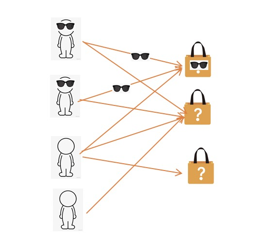

# a simple tutorial to DGL

这是浙江大学周晟老师[GNN课程](https://zhoushengisnoob.github.io/courses/index.html?course=gnn)的实践课程内容。
## DGL简介

DGL是一个易于使用、高性能和可扩展的Python包，用于深入学习图形。DGL与框架无关，这意味着如果深度图模型是端到端应用程序的一个组件，那么其余的逻辑可以在任何主要框架中实现，如PyTorch、Apache MXNet或TensorFlow。


## 重要的网站

### [DGL官网(dgl.ai)](https://www.dgl.ai/)

### [官方教程(A Blitz Introduction to DGL)](https://docs.dgl.ai/tutorials/blitz/index.html)

### [exmaples](https://github.com/dmlc/dgl/tree/master/examples)

### [User Guide](https://docs.dgl.ai/guide/index.html)

### [discuss.dgl.ai](https://discuss.dgl.ai/)

### https://github.com/dglai


## 安装

https://www.dgl.ai/pages/start.html

## DGL简单入门

### node cls

### sample

### Heterogeneous Graphs

## TASK link classification in Heterogeneous Graphs

本数据来源于某竞赛数据加工得到，简单而言，这是一个电商场景下，判断user与item构成的交易是否涉及诈骗的任务，user与item之间可以构成二部图，该任务即可看作边上的分类任务。


### 数据描述

`train_user_feature_table.csv` 训练集中user节点的属性特征

```bash
userid,feature_0,feature_1,feature_...
0,0.12,0.24,...
1,0.12,0.24,...
```

`train_item_feature_table.csv` 训练集中item节点的属性特征

```bash
itemid,feature_0,feature_1,feature_...
0,0.12,0.24,...
1,0.12,0.24,...
```

`train_e.csv` 训练集中的交易

```bash
userid,itemid,label
0,0,1
1,1,1
2,2,0
```

`test_user_feature_table.csv`,`test_item_feature_table.csv`,`test_e.csv`内容与train类似，不再赘述。
注test中的userid与train中的userid并不一致，比如train中userid为1的user与test中userid为1的user，并不是同一个user。

**数据见`task1_data/`**
### 任务

使用训练数据训练GNN模型，并尝试优化模型，在测试集上验证模型的效果。评价指标为`maxF1、AUC`（详细实现参见仓库）
[这里](https://github.com/miziha-zp/GNN_DGL_Task)提供了基于GDBT的`lgbbaseline.py`与基于GNN的`gnn_baseline.ipynb`两个基线。测试的环境如下：
`python==3.7.10`,且依赖包如`requirements.txt`。
巅峰内存 < 16G, 如果使用GPU，巅峰显存 <  10G

lightgbm作为GBDT的出色实现，是数据挖掘特别是表格数据挖掘的重要基线，由于其使用简单，效果显著深受工业界与学术界青睐，使用GNN在特定数据集（特别是风控领域的数据集）打败lightgbm是一个非常有意思的话题，这里提供了lightgbm的基线。效果超过lightgbm baseline的效果, 其效果如下:

```bash
AUC: 0.93751118
max F1: 0.6865486423126852
```


**评分标准**

1.打败LGB视为合格，会根据大家整体的情况给分。

2.最终需要提交可以一键运行的代码，以及不少于一页报告（内容包含但不限于优化思路、结果分析）

3.请不要偷看答案奥（需要合理划分验证集，直接对照测试集结果调参可能会被减分🤔）

## 参考

1. https://www.dgl.ai/
2. https://github.com/dmlc/dgl
3. https://github.com/dglai
